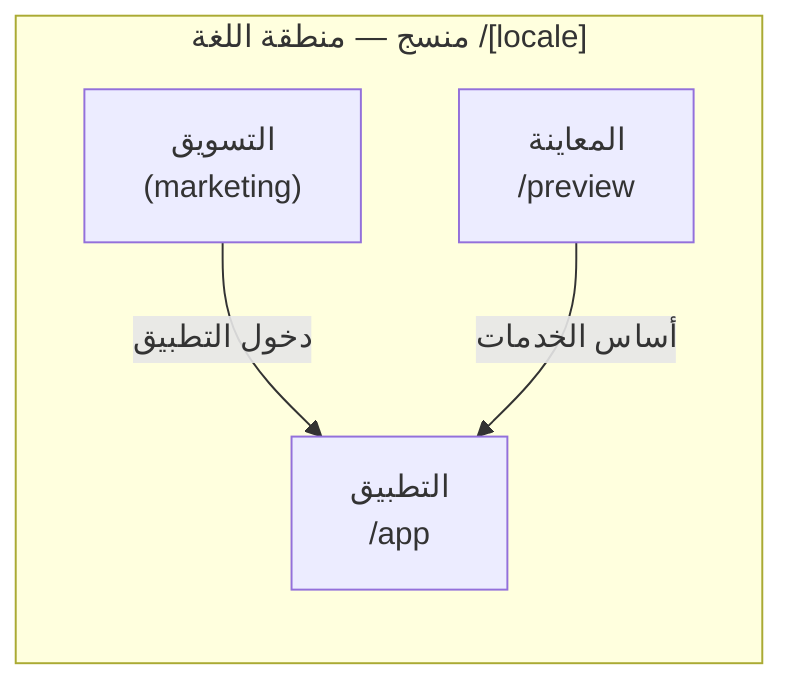
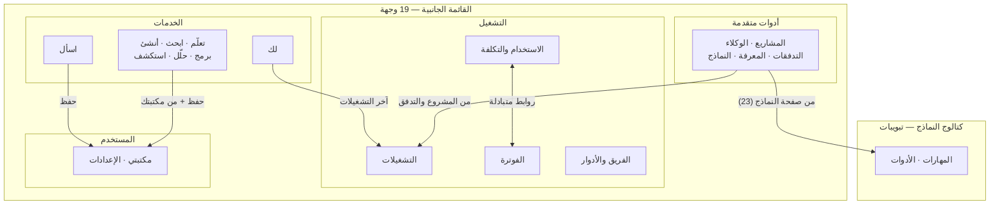

# هندسة المعلومات — خريطة المنصة
## Information Architecture · IA

> **الغرض:** المرجع الوحيد لما يوجد من مسارات، وكيف تترابط، وما زائف عن التنقل. أي إضافة مسار جديد أو تغيير مجموعات التنقل تبدأ من هنا وتعود إليها.

---

## 1. البنية العامة للمنصة

تتكون المنصة من ثلاث مناطق نطاقية تحت مسار اللغة `/[locale]`:

| المنطقة | المسار | الوظيفة | التصميم |
|---|---|---|---|
| **التسويق** | `/[locale]` (الجذر) | صفحة الهبوط: العرض، الخدمات، الثقة | سطوع فاتح، هوية العلامة الكاملة |
| **التطبيق** | `/[locale]/app/*` | مساحة العمل الكاملة | غلاف موحّد (App Shell) + لوحة داكنة للبوابات |
| **المعاينة** | `/[locale]/preview/*` | أسطح تحقق الأساس لمراحل بناء الخدمات | معزولة عن التنقل العام |

## 2. نموذج التنقل — القائمة الجانبية

مصدر الحقيقة: `src/components/app-shell/app-shell.tsx` (المصفوفات `primaryItems` / `advancedItems` / `operationsItems` / `utilityItems`).

| المجموعة | العناصر (19) |
|---|---|
| **الخدمات** | لك (home) · اسأل (chat) · تعلّم · ابحث · أنشئ · برمج · حلّل · استكشف |
| **أدوات متقدمة** | المشاريع · الوكلاء · التدفقات · مصادر المعرفة · النماذج |
| **التشغيل** | التشغيلات (runs) · الاستخدام والتكلفة · الفوترة · الفريق والأدوار |
| **أدوات المستخدم** | مكتبتي · الإعدادات |

قواعد النموذج:

1. الخدمات أولًا لأن «النية قبل الأداة» — هدف المستخدم الأساسي يظهر أعلى القائمة.
2. الأدوات المتقدمة مخصصة للمستخدم المتقدم ولا تظهر بذات الوزن البصري للخدمات.
3. مجموعة «التشغيل» (قرار KI-1، 2026-09-21) تستضيف طبقة التشغيل المرتبطة بوعد الشفافية (التكلفة والفريق) — بذات السجل البصري للأدوات المتقدمة.
4. مكتبتي والإعدادات في نهاية القائمة كأدوات شخصية ثابتة.
5. الروابط تخفي تسمياتها في وضع rail وتظهر كاملة في الوضع الموسّع، والقائمة تتمرر داخليًا عند تجاوز الارتفاع.
6. لوحة الأوامر ⌘K تبحث في الـ19 وجهة كلها — أي وجهة جديدة تُضاف للمصفوفات الأربع تلقائيًا تدخل اللوحة.

## 3. جدول المسارات الكامل

الحالة «في التنقل» تعني ظهور المسار في القائمة الجانبية. «يتيم» يعني مسارًا فعّالًا بلا مدخل تنقل.

**اصطلاح الهوية مقابل المسار (KI-4 مغلق):** الهوية المنتجية للبوابة المشتركة هي **`ask`** (كما في السجل و`universal-content`) بينما مسارها **`/app/chat`** — الاصطلاح المعتمد: «الهوية ask · المسار /chat»، والعنصر التنقلي يحمل id يطابق المسار (`chat`). البحث عن «ask» يقود إلى السجل والمحتوى؛ والبحث عن «chat» يقود إلى المسار.

| # | المسار (تحت `/[locale]`) | الصفحة | في التنقل | نوع العمل |
|---|---|---|---|---|
| 1 | `/` | صفحة التسويق | — | Marketing |
| 2 | `/app` | تحويل إلى `/app/home` | — | تحويل |
| 3 | `/app/home` | «لك» — الرئيسية التشغيلية | ✅ الخدمات | Snapshot تشغيلي |
| 4 | `/app/chat` | اسأل — البوابة المشتركة | ✅ الخدمات | Service Gateway |
| 5 | `/app/learn` | تعلّم — مساحة نطاقية | ✅ الخدمات | Domain Workspace |
| 6 | `/app/research` | ابحث — مساحة نطاقية | ✅ الخدمات | Domain Workspace |
| 7 | `/app/create` | أنشئ — مساحة نطاقية | ✅ الخدمات | Domain Workspace |
| 8 | `/app/code` | برمج — بوابة نموذجية | ✅ الخدمات | Service Gateway |
| 9 | `/app/analyze` | حلّل — بوابة نموذجية | ✅ الخدمات | Service Gateway |
| 10 | `/app/explore` | استكشف — بوابة نموذجية | ✅ الخدمات | Service Gateway |
| 11 | `/app/library` | مكتبتي | ✅ أدوات المستخدم | مكتبة |
| 12 | `/app/settings` | الإعدادات | ✅ أدوات المستخدم | إعدادات |
| 13 | `/app/projects` | المشاريع | ✅ متقدمة | Ops |
| 14 | `/app/projects/[projectId]` | تفاصيل مشروع | فرعي من 13 | Ops |
| 15 | `/app/agents` | الوكلاء | ✅ متقدمة | Ops |
| 16 | `/app/agents/new` | وكيل جديد | فرعي من 15 | Ops |
| 17 | `/app/agents/[agentId]/edit` | تحرير وكيل | فرعي من 15 | Ops |
| 18 | `/app/flows` | التدفقات | ✅ متقدمة | Ops |
| 19 | `/app/flows/new` | تدفق جديد | فرعي من 18 | Ops |
| 20 | `/app/flows/[flowId]/edit` | محرر التدفق | فرعي من 18 | Ops |
| 21 | `/app/knowledge` | مصادر المعرفة | ✅ متقدمة | Ops |
| 22 | `/app/knowledge/[collectionId]` | عرض مجموعة | فرعي من 21 | Ops |
| 23 | `/app/models` | النماذج | ✅ متقدمة | Ops |
| 24 | `/app/models/[modelId]` | صفحة نموذج | ✅ متقدمة (ديناميكي سليم — KI-2 مغلق كتشخيص خاطئ) | Ops |
| 25 | `/app/models/routing` | توجيه النماذج | فرعي من 23 | Ops |
| 26 | `/app/runs` | سجل التشغيلات | ✅ التشغيل | Ops |
| 27 | `/app/runs/[runId]` | تفاصيل تشغيل | فرعي من 26 | Ops |
| 28 | `/app/usage` | الاستخدام والتكلفة | ✅ التشغيل | Ops |
| 29 | `/app/billing` | الفوترة | ✅ التشغيل | Ops |
| 30 | `/app/team` | الفريق والأدوار | ✅ التشغيل | Ops |
| 31 | `/app/skills` | المهارات | رابط سياقي: تبويبات الكتالوج من 23 | Ops |
| 32 | `/app/tools` | الأدوات | رابط سياقي: تبويبات الكتالوج من 23 | Ops |
| 33 | `/preview` | فهرس المعاينة | — | Preview |
| 34 | `/preview/service-foundation` | أساس الخدمات | — | Preview |
| 35 | `/preview/service-code` | سطح تحقّق شريحة برمج (W-3) | — | Preview |
| 36 | `/preview/service-analyze` | سطح تحقّق شريحة حلّل (W-3) | — | Preview |
| 37 | `/preview/service-explore` | سطح تحقّق شريحة استكشف (W-3) | — | Preview |

## 4. خريطة الترابط

قراءة الخريطة: طبقة التشغيل داخل التنقل منذ إغلاق KI-1 (مجموعة «التشغيل» الرابعة)؛ المهارات والأدوات يبقيان مدخلهما رابطًا سياقيًا موثّقًا عبر تبويبات الكتالوج في صفحة النماذج — مسموح به وفق القاعدة §7.2 (بند تنقل أو رابط سياقي موثّق).

## 5. أنماط الحاويات (Container Ladder)

قانون العرض الأفقي للمحتوى — كل قسم يلتزم بحاويته:

| الحاوية | العرض | مخصصة لـ |
|---|---|---|
| `480px` | حزام الأدوات (3 أعمدة) | صفوف البطاقات القصيرة |
| `560px` | البدايات السريعة، المسار ثنائي الأعمدة | الشبكات المزدوجة |
| `720px → 1040px` | القماش الخطي للبوابة | السرد الرأسي للسsections |
| `840px` | الملقّن | تركيز الكتابة |
| `900px` | المسار الرباعي، من مكتبتك | الشرائط المتصلة |

القاعدة: المحتوى السردي (نص متصل) لا يتجاوز 720–840px حفاظًا على طول السطر العربي المقروء؛ الشبكات المرئية تتمدد حتى 1040px.

## 6. سجل الخدمة (Service Registry)

مصدر الحقيقة: `src/features/service-workbench/service-registry.ts`.

| الخدمة | routeId | المركّب الحالي | الحالة |
|---|---|---|---|
| learn | `R-U2-LRN-001` | domain_workspace | implemented |
| research | `R-U2-RSH-001` | domain_workspace | implemented |
| create | `R-U2-CRT-001` | domain_workspace | implemented |
| code | `R-U2-COD-001` | domain_workspace | implemented |
| analyze | `R-U2-ANA-001` | prototype_service_workspace | foundation |
| explore | `R-U2-EXP-001` | prototype_service_workspace | foundation |
| ask | — (البوابة المشتركة) | prototype عبر `/app/chat` (الاصطلاح: الهوية ask · المسار /chat) | gateway |

**معرّفات الشاشات** (`U2-XXX-001`) تُستخدم في وثائق المواصفات والتقييم — أي شاشة جديدة تأخذ معرّفًا بنفس النمط من مالك المنتج.

**إيصالات الشرائح (W-3):** الخدمة تُبلّغ `implemented` في السجل فقط عند هبوط شريحتها مع إيصال تحقّق طازج في `sliceReceipt` (أدلة البناء والفحص والبصري) وسطح تحقّق مدلول في `/preview/service-*`.

## 7. قواعد IA الملزمة

1. **مسار جديد = تحديث هذا الجدول أولًا** ثم تنفيذ الصفحة — لا عكس.
2. أي مسار تحت `/app/*` يجب أن يملك مدخلًا: بند تنقل، أو رابطًا سياقيًا موثّقًا في جدول المسارات.
3. مجموعات التنقل الأربع لا تُفكك — إضافة مجموعة خامسة تتطلب قرارًا موثّقًا فقط.
4. المسارات الديناميكية `[param]` تسمّى بأسماء صريحة صحيحة. (تنبيه أداة: مخرجات الطرفية قد تبتلع التسلسل `[m` من الأسماء — تحقق بايت-محمي قبل إعلان اسم معطوب — انظر KI-2 المغلق.)
5. المعاينة `/preview/*` لا تُضاف للتنقل العام أبدًا — إنها أسطح تحقق داخلي.
