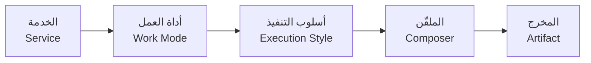
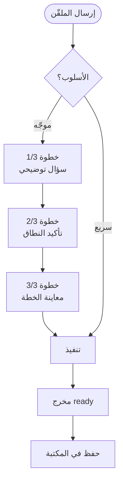
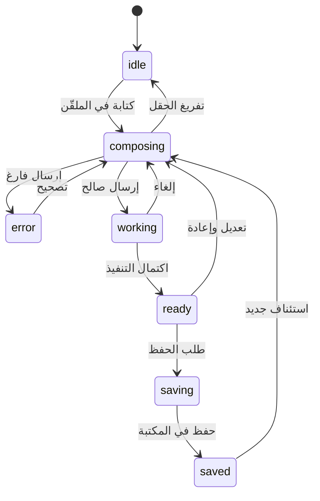

# منطق التفاعل — مصفوفة «إذا ضغط كذا → يفتح كذا»
## Interaction Logic · Decision Model

> **الغرض:** هذا الملف هو العقد الذي يحكم كل تفاعل اختيار في المنصة. أي زر أو بطاقة أو تبديل يجب أن يكون له سلوك معرّف هنا. **الاختلاف بين «شاشة تعمل» و«شاشة زينة» هو هذا الملف.**

---

## 1. النموذج الحاكم: تكوين ثلاثي

كل جلسة عمل في منسج تقوم على ثلاثة قرارات يخذها المستخدم بالتسلسل:

| القرار | السؤال الذي يجيب عنه | الطبقة |
|---|---|---|
| **الخدمة** | ما طبيعة مهمتي؟ (أسأل/أتعلم/أبحث…) | التنقل |
| **أداة العمل** | ما الشكل الذي أريد النتيجة عليه؟ (جدول، رسم، تحقق…) | حزام الأدوات في البوابة |
| **أسلوب التنفيذ** | كيف أريد أن يسير الوصول للنتيجة؟ (موجّه خطوة بخطوة / سريع مباشر) | بطاقتا التنفيذ |

**القانون:** التكوين `خدمة × أداة × أسلوب` يحدد بنية الشاشة وحالتها — ليس مجرد تمييز بصري.

## 2. مصفوفة أداة العمل — «ماذا يتغير عند اختيار أداة»

لكل خدمة ثلاث أدوات (تعريف حالي في `service-workspace.tsx`). اختيار أداة يُحدّث **أربعة أشياء إلزامية**:

| ما يتغير | كيف يتغير | لماذا |
|---|---|---|
| 1. تلميح الملقّن | `placeholder` يصبح جملة تخص الأداة: «صف البيانات وسأبني لك جدولًا…» | يقود كتابة المستخدم نحو المدخل الصحيح |
| 2. شكل المخرج المتوقع | عنوان `outputTitle` وذكر البطاقة يعرضان شكل النتيجة: جدول / رسم / تقرير تحقق | يضبط توقع المستخدم قبل التنفيذ |
| 3. البدايات السريعة | تُستبدل بثلاث بدايات خاصة بالأداة | نقرة واحدة بدل جملة |
| 4. إتاحات الملقّن | تظهر/تختفي حسب الأداة: أداة «رسم بياني» تُظهر رفع ملف؛ أداة «تحقق» تُظهر معيار الجودة | كل أداة تفتح مدخلاتها المنطقية فقط |

مثال موصّف — خدمة **حلّل**:

| الأداة | التلميح | المخرج | بداية سريعة | إتاحة إضافية |
|---|---|---|---|---|
| **جدول** | «صف بياناتك وسأنظّمها في جدول قابل للفرز» | «جدول منسّق جاهز للنسخ» | «حوّل هذا السجل إلى جدول» | رفع ملف CSV |
| **رسم بياني** | «أعطني الأرقام وسأقترح الرسم الأنسب» | «ملخص بصري قابل للتنزيل» | «ارسم اتجاه المبيعات» | رفع ملف/صورة |
| **تحقق من الجودة** | «الصق البيانات وسأفحص الاتساق والفجوات» | «تقرير تحقق قابل للتتبّع» | «افحص جودة هذا التقرير» | معيار جودة (قائمة) |

**الحالة اليوم:** الأداة تُحدّث `aria-pressed` والتمييز البصري فقط — **الأربعة الملزمة أعلاه غير مربوطة**. هذا هو النقص الأول في FR-3.1 ويُعدّ العمل الأول في المرحلة القادمة (roadmap.md · W-1).

## 3. مصفوفة أسلوب التنفيذ — «موجّه» مقابل «سريع»

الأسلوب يحدد **هيكل سير العمل** بعد الإرسال، لا مجرد سرعته:

| الجانب | **موجّه** (Guided) | **سريع** (Fast) |
|---|---|---|
| عدد الأسئلة قبل التنفيذ | 3 (النطاق، الجمهور، شكل المخرج) | 0 |
| زر الإرسال | «التالي» ثم «نفّذ» | «ابدأ الآن» مباشرة |
| المسار الرباعي في الصفحة | يعرض «جمع السياق» كخطوة حية تفاعلية | يعرضه منجزًا تلقائيًا (افتراضي) |
| زمن الوصول للنتيجة | أطول (بمقصد) | أقصر |
| لمن؟ | مهمة غامضة أو مستخدم جديد | مستخدم يعرف مطلوبه بدقة |
| حالة الإلغاء | متاحة في كل خطوة وتحفظ المسودة | متاحة أثناء working فقط |

**الحالة اليوم:** حالة `mode` موجودة في الكود (`guided`/`fast`) لكنها لا تغيّر شيئًا بعد الإرسال — كلا المسارين ينفّذان المحاكاة ذاتها. المواصفة أعلاه هي العقد المطلوب تنفيذه (FR-3.2 / FR-3.3 · roadmap W-2).

## 4. آلة حالات الجلسة (بوابة الخدمة)

| الحالة | الواجب البصري | الواجب المنطقي |
|---|---|---|
| `idle` | البوابة الكاملة سردًا خطيًا | لا طلبات معلقة |
| `composing` | إطار الملقّن يشتعل (focus-within) | تكوين نشط قابل للتعديل |
| `error` | رسالة داخل الملقّن، لا نافذة منبثقة | لا تنفيذ |
| `working` | مؤشر تقدم + تعطيل الإرسال (~820ms محاكاة) | يُمنع تعديل التكوين |
| `ready` | المخرج + المسار الرباعي مكتمل (01–04) | إتاحة الحفظ/التعديل |
| `saved` | توست تأكيد + شريط «من مكتبتك» يحدّث | العنصر يظهر في المكتبة |

**قواعد ملزمة:**

1. الانتقال بين الحالات هو **الوحيد** المسموح له بتغيير بنية الصفحة (إظهار المخرج، قلب الخطوات).
2. لا يجوز إخفاء أقسام البوابة (الأدوات/المسار/البدايات) في أي حالة — تتراجع كثافة لا الوجود.
3. كل انتقال له أثر واحد واضح — انتقالان بنفس الأثر يعنيان حالة زائدة تُحذف.

## 5. جدول التفاعلات الحرفي — كل نقرة وأثرها

المرجع السريع لكل تفاعل في البوابة (يُستخدم في المراجعات وفي اختبارات القبول):

| # | التفاعل | الأثر الإلزامي | الحالة |
|---|---|---|---|
| I-1 | نقر بطاقة أداة | تبديل `aria-pressed` + تفعيل المصفوفة الرباعية (§2) | نصف منجز |
| I-2 | نقر بطاقة أسلوب | تبديل `mode` + تغيير سير العمل (§3) | نصف منجز |
| I-3 | نقر بداية سريعة | تعبئة الملقّن + تركيز الحقل | منجز |
| I-4 | إرسال فارغ | حالة `error` داخلية | منجز |
| I-5 | إرسال صالح | `working` → `ready` + قلب المسار الرباعي | منجز |
| I-6 | نقر «حفظ» | `saving` → `saved` + دخول المكتبة | منجز (mock) |
| I-7 | نقر عنصر «من مكتبتك» | فتح العنصر في المكتبة | منجز |
| I-8 | نقر روابط تنقّل الخدمة | انتقال `/app/learn` أو `/app/library` | منجز |
| I-9 | نقر حبة إتاحة (ملف/صوت) | فتح منتقي الملف / حالة تسجيل | **شكلية — غير مربوطة** |
| I-10 | ⌘K | لوحة أوامر تبحث في 15 وجهة | منجز |

التفاعلات I-1 وI-2 وI-9 هي مقياس «المنطق قبل الزينة»: حاليًا نقراتها تغيّر المظهر دون الأثر — أي عمل مستقبلي على البوابات يبدأ بإكمالها.

## 6. قواعد كتابة أي تفاعل جديد

1. **أولًا الصف في جدول التفاعلات** (§5) — التفاعل غير المدرّج لا يُبنى.
2. صِف الأثر بفعل قابل للملاحظة (يفتح، يملأ، يبدّل، يحفظ) — لا بوصف بصري (يضيء، يتحرك).
3. كل تفاعل له نتيجة عكسية أو مسار رجوع — لا طرق مسدودة.
4. التفاعل الذي أثره «لا شيء» يُحذف من الواجهة، لا يُترك «للزينة».
5. التفاعلات الخطيرة (حذف، إرسال خارجي) تتطلب تأكيدًا صريحًا وتظهر سبب الخطر.
