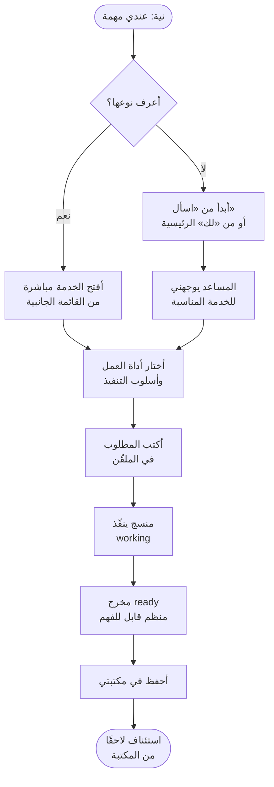
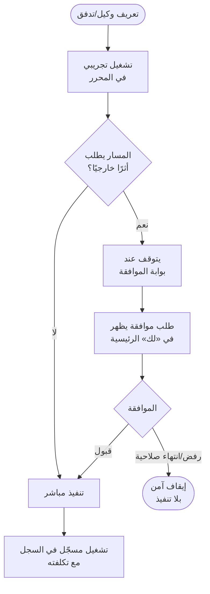
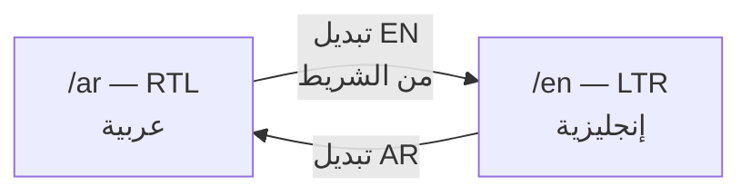

# مسارات المستخدم — User Flows
## الرحلات الكاملة من النية إلى المخرج المحفوظ

> **الغرض:** توثيق الطرق التي يسلكها المستخدم فعليًا عبر المنصة، بنقاط القرار والفشل والعودة. كل مسار هنا يجب أن يكون قابلاً للسير في المنتج الحالي — والمسارات المعطلة موسومة بوضوح.

---

## المسار الجوهري F-0 — «من فكرة إلى نتيجة محفوظة»

هذا هو المسار الذي وُجدت المنصة لأجله، وكل مسار آخر يخدمه:

نقاط الفشل المحروسة في هذا المسار: إرسال فارغ (خطأ داخلي بلا تنفيذ)، إلغاء أثناء working (عودة للملقّن مع المسودة)، وحفظ مكرر (العنصر نفسه يحدّث ولا يُستنسخ).

## F-1 — مسار البوابة النموذجية (اسأل/برمج/حلّل/استكشف)

الرحلة داخل بوابة الخدمة الواحدة، بالتكوين الثلاثي:

1. **الدخول:** من القائمة الجانبية (أو ⌘K) → البوابة تفتح على الحالة `idle` بأداة افتراضية واحدة مفعّلة وأسلوب «موجّه».
2. **التكوين:** المستخدم يختار أداة عمل (أو أكثر) وأسلوب تنفيذ — الشاشة تعيد هيكلتها وفق [interaction-logic.md](./interaction-logic.md).
3. **الصياغة:** كتابة الملقّن، أو نقرة بداية سريعة تعبّئه، أو رفع ملف (عند إتاحة الأداة).
4. **التنفيذ:** إرسال → working → ready. في أسلوب «موجّه»: ثلاث خطوات توضيحية قبل التنفيذ.
5. **الحصاد:** معاينة المخرج → حفظ في المكتبة → أو تعديل وإعادة.
6. **العزوف الآمن:** مغادرة الصفحة أثناء composing تحفظ مسودة تعود مع العودة (P1).

## F-2 — مسارات المساحات النطاقية (تعلّم/ابحث/أنشئ)

لكل مساحة نطاقية رحلة متخصصة فوق الهيكل الجوهري نفسه:

| المساحة | الدخول | الوحدة الأساسية | المخرج | ملاحظة |
|---|---|---|---|---|
| **تعلّم** | قائمة الخدمات → `/app/learn` | مسار تعلّم (path) بفصول وتقدّم | درس/اختبار منجز + تقدّم محفوظ | استئناف من نقطة التوقف |
| **ابحث** | → `/app/research` | خطة بحث بمصادر وخطوات | تقرير موثّق بمصادره | كل ادعاء مربوط بمصدر |
| **أنشئ** | → `/app/create` | موجز إنشاء (brief) → مسودات | مستند/عرض/محتوى مرئي | نسخ متعددة قابلة للمقارنة |

القاعدة الحاكمة للثلاث: **نفس آلة الحالات** (idle → working → ready → saved) لكن بوحدات مختلفة — لغة الواجهة تتكيف والمنطق لا يتغير.

## F-3 — مسار الفريق والموافقات (المستخدم المتقدم)

رحلة تشغيل وكيل أو تدفق يتطلب موافقة (البيانات الحالية من mock-api):

المبدأ: **كل أثر خارجي (إرسال بريد، نشر، تعديل خارجي) يتوقف عند بوابة موافقة صريحة** — لا تنفيذ خفي أبدًا (مبدأ «لا ثقة زائفة»).

## F-4 — مسار الشفافية التشغيلية (قائد الفريق)

رحلة متابعة التكلفة والاستخدام — حاليًا **معطلة تنقليًا** (الصفحات يتيمة):

1. الدخول المفترض: من «لك» الرئيسية → رصيد الميزانية → «الاستخدام والتكلفة».
2. في الاستخدام: اتجاه التكلفة اليومي + الرصيد المختلط (منصة/BYOK) + التفصيل بالأبعاد.
3. القفزات الجانبية: → الفوترة (حدود الإنفاق، تعبئة محاكاة) · → التشغيلات (سجل كامل بالتكلفة).
4. **العائق الحالي:** لا مدخل تنقل ثابت — المسار يعمل بالروابط المتبادلة فقط لمن يعرف العناوين. الإصلاح موثق في known-issues.md · KI-1.

## F-5 — مسار اللغة والاتجاه

قاعدة المسار: التبديل يحفظ موقع المستخدم الحالي (استبدال مقطع اللغة فقط — دالة `switchLocaleInPath`)، والمحتوى يتكافأ لغويًا بين المسارين. الجذر `/` يحوّل إلى `/ar` (العربية أولًا).

## F-6 — مسارات الفشل والتعافي

| السيناريو | السلوك الواجب | الحالة |
|---|---|---|
| مسار غير موجود | صفحة 404 باللغة الصحيحة + عودة للرئيسية | منجز |
| إرسال فارغ | خطأ داخلي في الملقّن | منجز |
| إلغاء أثناء التنفيذ | عودة للمسودة دون فقدان التكوين | منجز |
| رفض موافقة | إيقاف آمن + شرح السبب في سجل التشغيل | منجز (mock) |
| فشل حفظ | إبقاء المخرج ظاهرًا مع إعادة المحاولة | موصّف |

## قاعدة تحديث المسارات

أي ميزة جديدة تُحدد مسارها هنا **قبل** بنائها: نقاط الدخول، القرارات، الفشل، والتعافي. المسار غير المرسوم لا يُنفّذ — هذه هي طبقة «الدراسة قبل البناء» التي تحكم كل عمل قادم.
