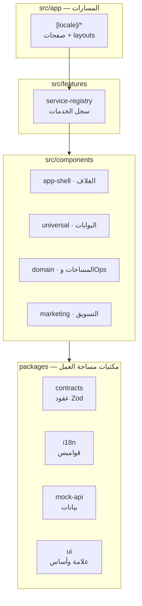

# البنية التقنية — Architecture
## طبقات الكود وقوانين البناء

> **الغرض:** كيف ينظم الكود نفسه: الطبقات، اتجاهات الاعتماد، وقوانين التعديل. أي إضافة تُقرأ من هنا أولًا.

---

## 1. الحزمة التقنية

| التقنية | الإصدار | الدور |
|---|---|---|
| Next.js (App Router) | ^16.1.1 | الإطار — Turbopack في التطوير |
| React | ^19 | واجهة المستخدم |
| TypeScript | ^5 | الأنواع عبر الطبقات كلها |
| Radix UI | react-dialog 1.1.x | الحوارات وسلوك الوصولية |
| lucide-react | 1.44.0 | الأيقونات (المصدر الوحيد) |
| next-themes | ^0.4.6 | تبديل الثيم |
| cmdk | ^1.1.1 | لوحة الأوامر ⌘K |
| framer-motion | ^12 | الحركات المعقدة |
| Tailwind CSS 4 | ^4 | متاح للمرافق — **الهوية كلها في طبقة CSS مخصصة** |
| Zod | 4.6.2 | عقود البيانات في `packages/contracts` |
| Node | 24.x | وقت التشغيل (يطابق Vercel) |

## 2. الخريطة الطبقية



**اتجاه الاعتماد صاعد فقط:** المسارات → السجل → المكوّنات → الحزم. الحزم لا تستورد من `src/` أبدًا. كسر الاتجاه = إعادة هيكلة إلزامية.

## 3. القرارات المعمارية الحاكمة

| # | القرار | الأثر |
|---|---|---|
| A-1 | **سجل الخدمة** (`service-registry.ts`) هو نقطة قلب كل مساحة خدمة من النموذجية إلى النطاقية | إضافة مساحة نطاقية = قلب سطر واحد + بناء الشريحة |
| A-2 | **CSS معماري بطبقات** (universal.css يستورد 14 ملفًا مرتبًا) | لا CSS مبعثر في المكونات |
| A-3 | **طبقة v21 مضمّنة** داخل universal.css (حل تعطل @import في Turbopack) | لا تُفك — تُرحل بحذر عند ترقية Next |
| A-4 | **i18n بمسار `[locale]`** والقواميس في `packages/i18n` | كل نص جديد يمر من القاموس |
| A-5 | **mock-api كمصدر بيانات وحيد** بعقود Zod | الواجهة جاهزة للربط الحقيقي بتبديل العميل |
| A-6 | **شاشات المعاينة** معزولة تحت `/preview` | سطح تحقق بلا دخول في التنقل |
| A-7 | **turbopack.root** مضبوط في بيئة التطوير المحلية فقط | انتبه: نسخة المستودع خالية منه |

## 4. أوامر البناء

```bash
npm ci                 # تثبيت حتمي (PRISMA_SKIP_POSTINSTALL_GENERATE=1 اختياري)
npm run dev            # تطوير — localhost:3000
npm run build          # بناء إنتاجي — يجب أن ينجح بكل المسارات
npm run lint           # ESLint — نظيف قبل أي دفعة
npx tsc --noEmit       # فحص أنواع — الأخطاء المعروفة الموثقةة وحدها مستثناة
```

## 5. قوانين التعديل

1. **لا ملف جديد بلا موضع طبقي صحيح** — من الخريطة أعلاه.
2. **المسار الجديد يبدأ من جدول IA** (information-architecture.md §3) ثم `page.tsx` نحيف يستدعي مكوّنًا.
3. **منطق صفحة الخدمة لا يُكتب في page.tsx** — الصفحات تكوين استدعاء فقط، المنطق في المكوّن والبيانات في الطبقات.
4. **أي تعديل على universal.css يمر بمراجعة نظام التصميم** (design-system.md §8).
5. **حزم packages تُبنى كمساحة عمل npm** — تعديل عقد = تحديث mock-api في الكوميت نفسه.

## 6. النشر

| البند | القيمة |
|---|---|
| المنصة | Vercel — مشروع `minsaj-ai-platform` (فريق 4zobir89-lab) |
| المشغّل | نشر تلقائي عند كل دفعة لـ `main` |
| الفرع الإنتاجي | `main` فقط — لا نشر من فروع أخرى |
| Node | 24.x |
| متغيرات بيئة | **لا شيء مطلوب حاليًا** — التطبيق بلا خدمات خارجية |

**بروتوكول الدفعة الآمنة:** بناء محلي ناجح → lint نظيف → دفعة → انتظار ~2 دقيقة → فحص URL الإنتاج (200) → تدوين في CHANGELOG. أي فشل نشر يعني تراجعًا (revert) فوريًا لا «إصلاح فوق فشل».
