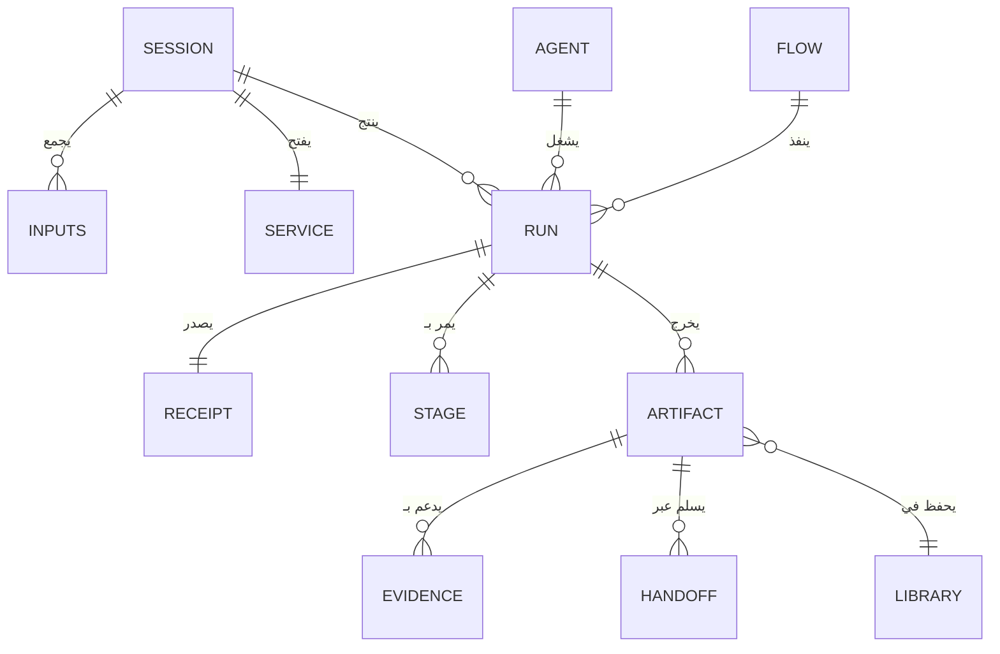
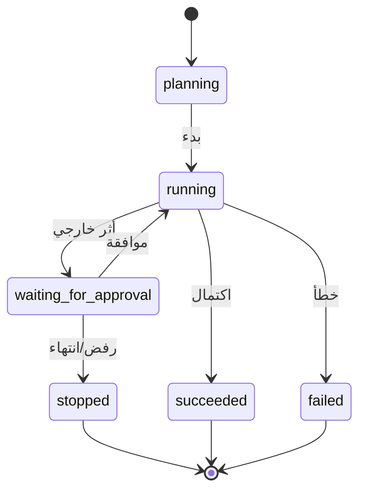

# نموذج البيانات — Data Model
## العقود والكيانات في packages/contracts + mock-api

> **الغرض:** خريطة الكيانات التي تتحدثها الواجهة اليوم (طبقة mock) والعقود المعدّة للربط الحقيقي غدًا. تعديل أي كيان يبدأ من هنا.

---

## 1. الكيانات الجوهرية (contracts/services)

مصدر الحقيقة: `packages/contracts/src/services/*.ts` — كلها مخطّطة بـ Zod وقابلة للتحقق وقت التشغيل.

| الكيان | الملف | الوصف |
|---|---|---|
| **Session** | `session.ts` | جلسة عمل مستخدم ضمن خدمة — حاملة التكوين (خدمة/أداة/أسلوب) |
| **Stages / Transitions** | `stages.ts` · `transitions.ts` | مراحل التنفيذ وانتقالاته المشروعة — العمود الفقري لآلة الحالات |
| **Run** | `run.ts` | تشغيل واحد: الحالة، التقدّم، التكلفة، الطابع الزمني |
| **AgentDefinition** | `agentDefinitionSchema` | تعريف وكيل قابل للتشغيل |
| **FlowDefinition** | `flowDefinitionSchema` | تعريف تدفق بعقد وبوابات موافقة |
| **Artifact** | `artifacts.ts` | مخرج منظم ناتج عن تشغيل — وحدة الحفظ في المكتبة |
| **Evidence** | `evidence.ts` | مصدر/إثبات يربط ادعاءً بمخرج — أساس «لا ثقة زائفة» |
| **Receipt** | `receipt.ts` | إيصال تكلفة التشغيل (amountMinor + currency) |
| **Handoff** | `handoff.ts` | تسليم بين مراحل أو وكلاء |
| **Inputs** | `inputs.ts` | مدخلات المستخدم (نص/ملف/صوت) |
| **Enums / IDs** | `enums.ts` · `ids.ts` | الحالات المعرّفة وأنماط المعرفات (`run_*` …) |

## 2. علاقات الكيانات

قراءة العلاقات: الجلسة هي وحدة تكوين المستخدم؛ التشغيل هو وحدة التنفيذ والمساءلة (تقدمه وتكلفته)؛ المخرج هو وحدة القيمة المحفوظة؛ والدليل هو ضمير النظام — لا مخرج بلا مصدر قابل للتتبّع عند الحاجة.

## 3. لقطات mock-api الجاهزة

`packages/mock-api` يقدم لقطات مركّبة (snapshots) تُغذي الشاشات مباشرة:

| اللقطة | تخدم | أبرز الحقول |
|---|---|---|
| **homeSnapshot** | «لك» الرئيسية | workspace · balance (mixed payer) · activeRuns[] · approvals[] |
| **operationsSnapshot** | المشاريع/الوكلاء/التدفقات/المعرفة | تعريفات وحالات |
| **workspaceAdminSnapshot** | usage/team/skills/tools/billing | أعضاء، أدوار، رصيد، حدود |
| **runDetail** | تفاصيل التشغيل | أحداث المراحل + الإيصال |

**بيانات موجودة للاستناد (لا تُخترع من جديد):** رصيد `$48.20` مستهلك 37% · خطة «فريق محترف» 5 مقاعد · فاتورة 1 Oct 2026 بـ `$29.00` · حد مساحة 75$ وتنبيه 75% وسقف تشغيل 1.2$ · Visa 4242 · تشغيلات نشطة مثل `run_market_research` (64%) و`run_weekly_watch` (waiting_for_approval, 72%).

## 4. آلة حالات التشغيل (Run Lifecycle)

**قاعدة العرض:** كل حالة لها شارة موحّدة (success/warning/neutral) ووصف عربي دقيق — `waiting_for_approval` تسمى «بانتظار موافقة» وتظهر في الرئيسية ضمن طلبات الموافقة بمهلتها.

## 5. عقود قادمة عند الربط الحقيقي

الطبقة معدّة بحيث يُستبدل `mock-api` بمكالمة شبكة تحترم العقود نفسها:

1. العقد لا يتغير — يتغير الموفر فقط (`provider: mock → http`).
2. كل استدعاء يمر عبر `client.ts` المركزي — لا جلب مباشر داخل المكونات.
3. حالة `mockScenario = "happy"` تُستبدل بسيناريوهات خطأ حقيقية تختبر مسارات الفشل (F-6).

## 6. قوانين تعديل البيانات

1. **العقد أولًا:** أي حقل جديد يبدأ مخطّطًا في contracts ثم يظهر في mock ثم في الواجهة — لا عكس.
2. الحقول ثنائية اللغة دائمًا `{ ar, en }` — حقل أحادي اللغة يُرفض.
3. المبالغ بـ `amountMinor` (سنتات) مع `currency` — لا float أبدًا.
4. معرّفات الكيانات بنمط مسمّى (`run_*`, `apr_*`) — تُعرض بخط Mono.
5. تعديل كيان يستوجب تحديث: العقد + المزود الوهمي + كل مستهلكيه (Grep إلزامي) في كوميت واحد.
